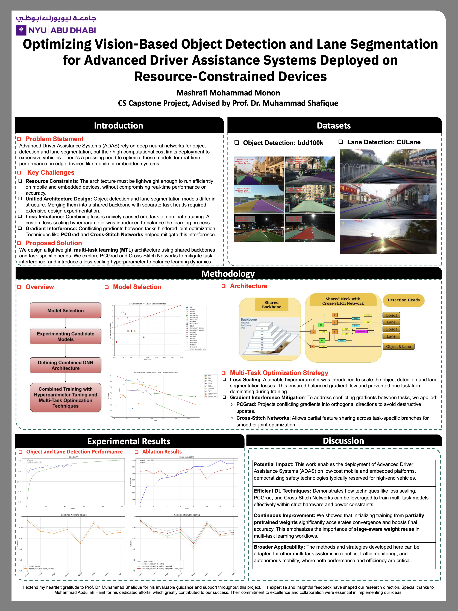
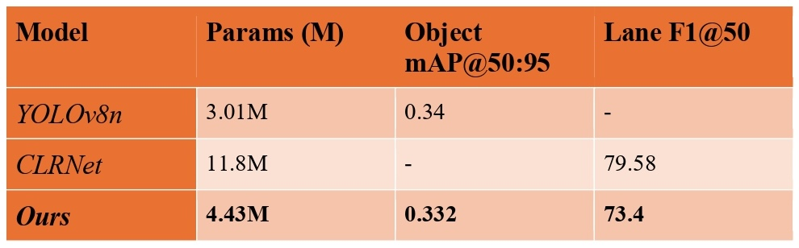
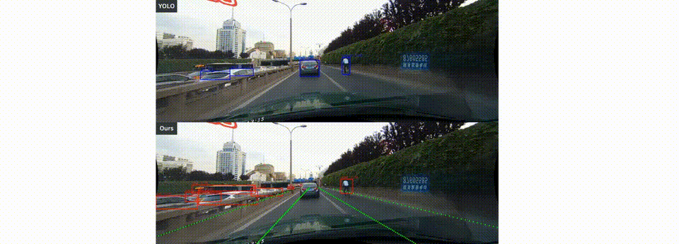

# Optimizing Vision-Based Object Detection and Lane Segmentation for ADAS

This capstone explores a multi-task vision stack for ADAS that combines object detection and lane segmentation, aiming to keep accuracy while reducing cost on resource-constrained devices. The system builds on YOLO-style detection and CLRNet-style lane detection, and studies multi-task training strategies such as cross-stitching and gradient conflict handling.

Quick reads: `report.pdf` · `poster.pdf`



Key results and a qualitative demo are shown below.





## Method
Two task-specific heads share features through multi-task coupling, with experiments on cross-stitch layers and PCGrad/FAMO-style optimization.

## Repository Structure
- `main.py`: main experiment entry point used during development.
- `mains/`: alternative training scripts for different multi-task setups.
- `multitask.py`, `multitasks/`: multi-task model variants and utilities.
- `clrnet/`, `nets/`, `utils/`, `losses/`: core model components and training helpers.
- `configs/`: CLRNet configuration files.
- `runs/`, `scores/`: experiment outputs and summaries.

## Environment
Install dependencies:
```bash
pip install -r requirements.txt
```

## Data
The training pipeline expects datasets like BDD100K (object detection) and CULane (lane segmentation). Paths are configured in the scripts and config files under `configs/` and `utils/`.

## Training and Evaluation
Start from `main.py`, or use the variants under `mains/` to reproduce specific experiments:
```bash
python main.py
```
Adjust configs and checkpoints in `configs/` and the relevant `mains/*.py` script before running.

## Artifacts
The poster and report are included for quick project context. The presentation PDF is intentionally ignored via `.gitignore`.

## Acknowledgments and Citations
- CLRNet (lane detection backbone): https://github.com/Turoad/CLRNet
- Ultralytics YOLOv8 (object detection backbone): https://github.com/ultralytics/ultralytics
- PCGrad (gradient conflict handling): https://github.com/WeiChengTseng/Pytorch-PCGrad
- Object Detection Metrics utilities: https://github.com/rafaelpadilla/Object-Detection-Metrics
- timm EMA utilities: https://github.com/rwightman/pytorch-image-models
- DIoU-SSD utilities: https://github.com/Zzh-tju/DIoU-SSD-pytorch
- Kornia focal loss reference: https://github.com/kornia/kornia
- Unsupervised LLAMAS utilities: https://github.com/karstenBehrendt/unsupervised_llamas
- py-faster-rcnn NMS reference: https://github.com/rbgirshick/py-faster-rcnn
